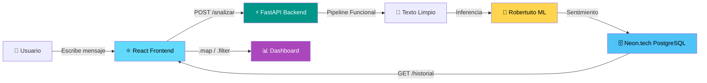
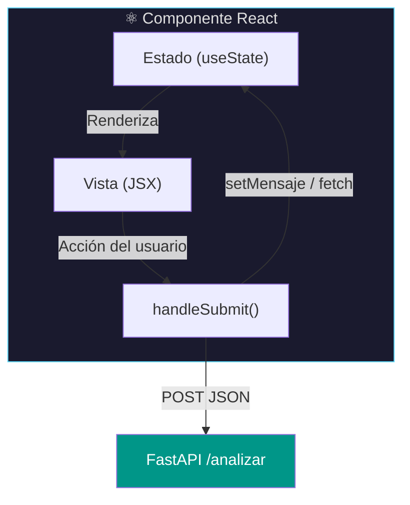
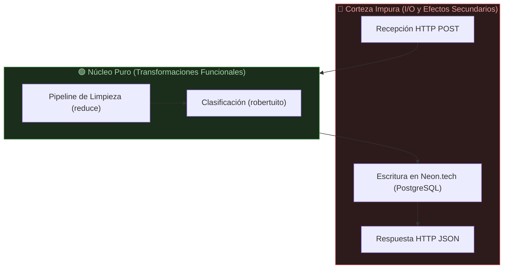
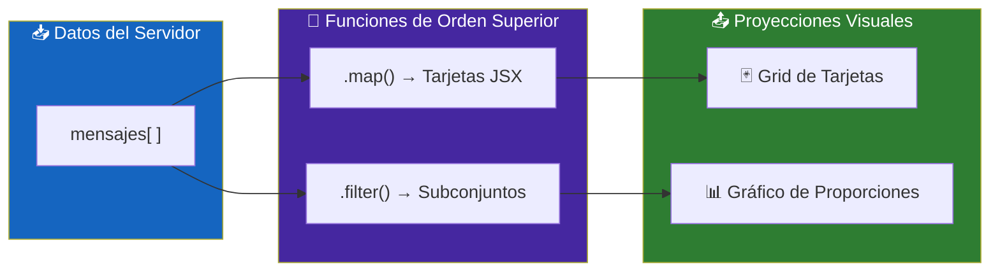
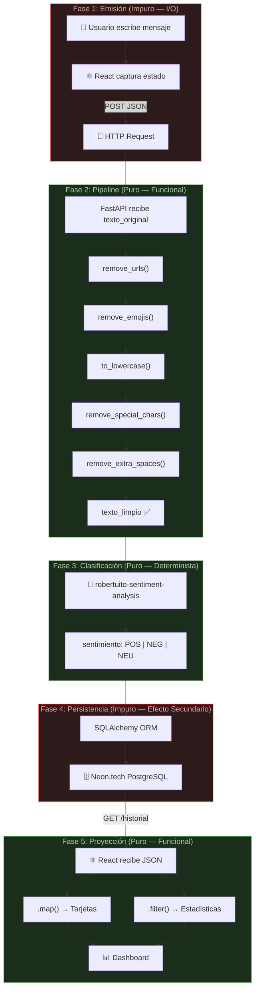

# Arquitectura del Sistema

## Visión General

La presente arquitectura adopta un diseño por capas desacopladas que orbita en torno a un principio rector: **el dato fluye a través de transformaciones puras y predecibles, mientras que los efectos secundarios quedan confinados en los bordes del sistema**. Esta decisión de diseño no es arbitraria; responde a la aplicación deliberada de los fundamentos del **Paradigma Funcional** en un contexto de ingeniería de software moderna.

El sistema se compone de un **frontend** construido con React, un **backend** implementado en FastAPI (Python), un **modelo de Machine Learning** pre-entrenado (`robertuito-sentiment-analysis`) alojado en HuggingFace, y una **base de datos relacional** PostgreSQL gestionada por el servicio Neon.tech a través del ORM SQLAlchemy.

A continuación, se describe de forma exhaustiva el **ciclo de vida del dato** —desde la captura del mensaje del usuario hasta su proyección visual en el dashboard—, vinculando cada etapa con los conceptos fundamentales del paradigma funcional.



---

## Fase 1: Emisión y Flujo Unidireccional (Frontend)

### 1.1. Captura del Dato de Entrada

El ciclo de vida del dato se inicia en la **interfaz de usuario**, construida con la biblioteca React. El usuario interactúa con un componente de formulario —un campo de texto y un botón de envío— que constituye el único punto de entrada de datos al sistema.

Cuando el usuario escribe un mensaje y presiona el botón de enviar, React captura el valor del campo de texto a través de su mecanismo de **estado local** (`useState`). Este estado es una variable reactiva encapsulada dentro del componente; su modificación desencadena un nuevo ciclo de renderizado, lo cual garantiza que la interfaz siempre refleje el valor más reciente del dato.

```jsx
const [mensaje, setMensaje] = useState("");

const handleSubmit = async (e) => {
  e.preventDefault();
  const payload = { texto_original: mensaje };

  await fetch("http://localhost:8000/analizar", {
    method: "POST",
    headers: { "Content-Type": "application/json" },
    body: JSON.stringify(payload),
  });

  setMensaje(""); // Resetea el estado local tras el envío
};
```

### 1.2. Construcción y Emisión del Payload

El valor capturado se encapsula en un objeto JSON con la estructura `{ "texto_original": "..." }` y se transmite mediante una solicitud **HTTP POST** hacia el endpoint `/analizar` del backend. Este objeto JSON constituye el **payload** de la petición, es decir, la carga útil de datos que viaja desde el cliente hacia el servidor.

### 1.3. Vínculo con el Paradigma Funcional: Flujo de Datos Unidireccional

React implementa de forma nativa un **flujo de datos unidireccional** (*one-way data flow*). Este concepto establece que la información se propaga en una sola dirección: desde el estado del componente hacia la vista (renderizado) y desde la acción del usuario hacia la actualización del estado. No existen enlaces bidireccionales (*two-way bindings*) que muten el estado de forma implícita.

Este patrón guarda una estrecha relación con el paradigma funcional, donde las **funciones reciben entradas y producen salidas sin alterar estado externo**. En React, el componente se comporta como una función pura del estado: dado un mismo estado, siempre se renderiza la misma vista.

> [!IMPORTANT]
> El flujo unidireccional elimina efectos colaterales impredecibles en la capa de presentación. Cada ciclo de renderizado es una **proyección determinista** del estado actual, lo cual facilita el razonamiento sobre el comportamiento del sistema.



---

## Fase 2: El Pipeline Inmutable (El Corazón Funcional del Backend)

### 2.1. Recepción del Dato en FastAPI

El backend, implementado con el framework **FastAPI** de Python, recibe la solicitud POST en su endpoint `/analizar`. FastAPI deserializa automáticamente el cuerpo JSON de la petición y lo valida contra un esquema definido mediante **Pydantic**, una biblioteca de validación de datos basada en anotaciones de tipo:

```python
from pydantic import BaseModel

class MensajeInput(BaseModel):
    texto_original: str
```

En este punto, el sistema dispone del `texto_original` —la cadena de texto cruda tal como la escribió el usuario— y comienza la fase de **transformación funcional**.

### 2.2. Definición de Funciones Puras de Transformación

Antes de enviar el texto al modelo de Machine Learning, es necesario someterlo a un proceso de **normalización** o **limpieza**. Este proceso se implementa mediante un conjunto de **funciones puras**.

Una **función pura** es aquella que cumple con dos propiedades fundamentales:

1. **Determinismo**: dada la misma entrada, siempre produce la misma salida.
2. **Ausencia de efectos secundarios**: no modifica ningún estado externo, no altera variables globales, no escribe en bases de datos ni en el sistema de archivos.

Cada función de limpieza recibe una cadena de texto como argumento y retorna una **nueva cadena de texto** transformada, sin modificar la cadena original:

```python
def to_lowercase(texto: str) -> str:
    """Convierte todos los caracteres a minúsculas."""
    return texto.lower()

def remove_special_chars(texto: str) -> str:
    """Elimina caracteres especiales, conservando letras, números y espacios."""
    return re.sub(r'[^a-záéíóúüñ0-9\s]', '', texto)

def remove_extra_spaces(texto: str) -> str:
    """Reduce múltiples espacios consecutivos a un único espacio."""
    return re.sub(r'\s+', ' ', texto).strip()

def remove_urls(texto: str) -> str:
    """Elimina URLs del texto."""
    return re.sub(r'http\S+|www\.\S+', '', texto)

def remove_emojis(texto: str) -> str:
    """Elimina caracteres emoji del texto."""
    patron_emojis = re.compile(
        "[" "\U0001F600-\U0001F64F" "\U0001F300-\U0001F5FF"
        "\U0001F680-\U0001F6FF" "\U0001F1E0-\U0001F1FF" "]+",
        flags=re.UNICODE
    )
    return patron_emojis.sub('', texto)
```

> [!NOTE]
> Obsérvese que ninguna de estas funciones utiliza la palabra clave `global`, ni modifica una lista, ni escribe en un archivo. Cada una **recibe un `str` y retorna un nuevo `str`**. Este es el sello distintivo de la pureza funcional.

### 2.3. Composición mediante una Función de Orden Superior: `reduce`

Las funciones puras definidas en la sección anterior deben ejecutarse **en secuencia**, donde la salida de una función se convierte en la entrada de la siguiente. Este patrón se denomina **composición de funciones** y es uno de los pilares del paradigma funcional.

Para orquestar esta composición, el sistema emplea la función `reduce` del módulo `functools` de Python. `reduce` es una **función de orden superior** (*higher-order function*), lo cual significa que recibe **otras funciones como argumento**.

```python
from functools import reduce

# Lista ordenada de transformaciones puras
pipeline_limpieza = [
    remove_urls,
    remove_emojis,
    to_lowercase,
    remove_special_chars,
    remove_extra_spaces,
]

def limpiar_texto(texto_original: str) -> str:
    """
    Aplica secuencialmente todas las funciones de limpieza
    mediante composición funcional orquestada por reduce.
    """
    texto_limpio = reduce(
        lambda texto_acumulado, funcion: funcion(texto_acumulado),
        pipeline_limpieza,
        texto_original  # Valor inicial del acumulador
    )
    return texto_limpio
```

La mecánica interna de `reduce` en este contexto opera de la siguiente manera:

| Iteración | `texto_acumulado` (entrada) | `funcion` aplicada | Resultado (nueva entrada) |
|:---------:|:---|:---|:---|
| 1 | `texto_original` | `remove_urls` | Texto sin URLs |
| 2 | Texto sin URLs | `remove_emojis` | Texto sin URLs ni emojis |
| 3 | Texto sin URLs ni emojis | `to_lowercase` | Texto en minúsculas |
| 4 | Texto en minúsculas | `remove_special_chars` | Texto sin caracteres especiales |
| 5 | Texto sin caracteres especiales | `remove_extra_spaces` | **`texto_limpio` final** |


### 2.4. Vínculo con el Paradigma Funcional: Inmutabilidad Absoluta

El concepto de **inmutabilidad** establece que, una vez creado, un dato **no debe ser modificado**. En lugar de alterar el valor original, cada transformación produce un **nuevo valor**. El `texto_original` que ingresó al pipeline permanece intacto en memoria; lo que se propaga hacia la siguiente fase es una entidad completamente nueva: el `texto_limpio`.

Este principio tiene consecuencias prácticas de gran relevancia:

- **Trazabilidad**: al conservar tanto el `texto_original` como el `texto_limpio`, es posible auditar y reproducir cada transformación en cualquier momento.
- **Ausencia de errores por mutación compartida**: dado que ninguna función modifica el dato de entrada, se eliminan por completo las condiciones de carrera (*race conditions*) y los errores derivados de la mutación inesperada de estado compartido.
- **Testabilidad**: cada función puede probarse de forma aislada con entradas y salidas predefinidas, sin necesidad de simular contextos globales ni dependencias externas.

> [!CAUTION]
> En un diseño imperativo tradicional, sería tentador modificar la variable `texto_original` directamente en cada paso (e.g., `texto_original = texto_original.lower()`). Este enfoque **viola la inmutabilidad**, dificulta la depuración y destruye la posibilidad de auditoría del dato original. El diseño funcional adoptado evita deliberadamente esta práctica.

---

## Fase 3: Clasificación Determinista (Machine Learning)

### 3.1. Ingreso del Texto Limpio al Modelo

Una vez que el pipeline de limpieza produce el `texto_limpio`, este se envía como entrada al modelo de **análisis de sentimiento**. El sistema utiliza el modelo pre-entrenado `robertuito-sentiment-analysis`, disponible en la plataforma HuggingFace. Este modelo está basado en la arquitectura **RoBERTa** (una variante optimizada de BERT), específicamente ajustado (*fine-tuned*) para clasificar texto en español según su polaridad sentimental.

La integración se realiza mediante la biblioteca `transformers` de HuggingFace, que proporciona la abstracción `pipeline` para simplificar la carga del modelo y la ejecución de inferencias:

```python
from transformers import pipeline

# Carga del modelo pre-entrenado (se ejecuta una sola vez al iniciar el servidor)
clasificador = pipeline(
    "sentiment-analysis",
    model="pysentimiento/robertuito-sentiment-analysis"
)

def clasificar_sentimiento(texto_limpio: str) -> str:
    """
    Recibe el texto limpio y retorna la etiqueta de sentimiento
    predicha por el modelo ('POS', 'NEG' o 'NEU').
    """
    resultado = clasificador(texto_limpio)
    return resultado[0]["label"]  # e.g., "POS", "NEG", "NEU"
```

### 3.2. Taxonomía de la Clasificación

El modelo `robertuito-sentiment-analysis` clasifica cada texto en una de tres categorías discretas:

| Etiqueta | Significado | Ejemplo ilustrativo |
|:--------:|:------------|:--------------------|
| `POS` | Sentimiento **positivo** | *"Me encanta esta aplicación, funciona perfecto"* |
| `NEG` | Sentimiento **negativo** | *"Pésimo servicio, no lo recomiendo"* |
| `NEU` | Sentimiento **neutro** | *"El horario de atención es de 9 a 18"* |

### 3.3. Vínculo con el Paradigma Funcional: Determinismo y Transparencia Referencial

Desde la perspectiva del paradigma funcional, la inferencia del modelo se comporta como una **función determinista**: dada una misma cadena de texto como entrada, el modelo produce invariablemente la misma etiqueta de sentimiento como salida. No existen variables aleatorias ni efectos estocásticos en tiempo de inferencia (la aleatoriedad se limitó exclusivamente a la fase de entrenamiento del modelo, que es externa al sistema en producción).

Este comportamiento satisface el principio de **transparencia referencial** (*referential transparency*): la invocación `clasificar_sentimiento("me encanta esta app")` puede ser sustituida por su resultado `"POS"` en cualquier punto del programa sin alterar el comportamiento del sistema. La función no consulta la hora del sistema, no lee archivos, no depende de variables globales mutables; su resultado está **exclusivamente determinado por su entrada**.


> [!TIP]
> La transparencia referencial del modelo habilita una optimización clave: el **caché de inferencias** (*memoization*). Si un texto idéntico ya fue clasificado previamente, el sistema podría retornar el resultado almacenado sin invocar al modelo, reduciendo latencia y consumo de recursos. Esta técnica es viable precisamente porque el modelo se comporta como una función pura.

---

## Fase 4: Aislamiento de Efectos Secundarios (Persistencia en Neon.tech)

### 4.1. Construcción del Registro

Al finalizar las fases de transformación pura (limpieza) y clasificación determinista (inferencia), el sistema dispone de tres datos concretos:

1. `texto_original` — el mensaje tal como lo escribió el usuario.
2. `texto_limpio` — el resultado del pipeline de normalización.
3. `sentimiento` — la etiqueta predicha por el modelo (`POS`, `NEG` o `NEU`).

Con estos tres valores se construye una instancia del modelo ORM `Mensaje`, definido mediante **SQLAlchemy**, que mapea directamente a la tabla `mensaje` de la base de datos PostgreSQL alojada en Neon.tech:

```python
from sqlalchemy import Column, Integer, String, DateTime
from sqlalchemy.sql import func
from database import Base

class Mensaje(Base):
    __tablename__ = "mensaje"

    id              = Column(Integer, primary_key=True, index=True, autoincrement=True)
    texto_original  = Column(String, nullable=False)
    texto_limpio    = Column(String, nullable=False)
    sentimiento     = Column(String, nullable=False)
    fecha_creacion  = Column(DateTime, server_default=func.now())
```

| Columna | Tipo | Descripción |
|:--------|:-----|:------------|
| `id` | `Integer` | Clave primaria autoincremental |
| `texto_original` | `String` | Texto crudo ingresado por el usuario |
| `texto_limpio` | `String` | Texto resultante del pipeline funcional |
| `sentimiento` | `String` | Etiqueta de clasificación (`POS`, `NEG`, `NEU`) |
| `fecha_creacion` | `DateTime` | Marca temporal de inserción (generada por el servidor de BD) |

### 4.2. Ejecución de la Operación de Escritura

La inserción del registro en la base de datos se realiza a través de una sesión de SQLAlchemy:

```python
def guardar_mensaje(db: Session, texto_original: str, texto_limpio: str, sentimiento: str):
    """
    Persiste el resultado del análisis en la base de datos.
    Esta función constituye un EFECTO SECUNDARIO controlado.
    """
    nuevo_mensaje = Mensaje(
        texto_original=texto_original,
        texto_limpio=texto_limpio,
        sentimiento=sentimiento,
    )
    db.add(nuevo_mensaje)
    db.commit()
    db.refresh(nuevo_mensaje)
    return nuevo_mensaje
```

### 4.3. Vínculo con el Paradigma Funcional: Efectos Secundarios y la Arquitectura de "Núcleo Puro, Corteza Impura"

En el paradigma funcional estricto, un **efecto secundario** (*side effect*) es cualquier operación que interactúa con el mundo exterior al programa: escribir en una base de datos, enviar un correo electrónico, modificar un archivo en disco, o incluso imprimir en consola. Estas operaciones son inherentemente **impuras** porque su resultado no depende exclusivamente de sus parámetros de entrada —dependen del estado de un sistema externo que puede fallar, estar inaccesible o comportarse de forma no determinista.

La operación `guardar_mensaje()` es un efecto secundario: **muta el estado de un sistema externo** (la base de datos PostgreSQL en Neon.tech). Sin embargo, el diseño arquitectónico adoptado minimiza el impacto de esta impureza mediante una estrategia deliberada:

> **Las impurezas se empujan hacia los bordes del sistema.**

El **núcleo del backend** —el pipeline de limpieza y la clasificación— es completamente **puro y determinista**. Las operaciones de entrada/salida (recibir la petición HTTP, escribir en la base de datos, retornar la respuesta) se ubican en la **periferia** del sistema, actuando como una "corteza" que envuelve al núcleo funcional.



Esta arquitectura, frecuentemente denominada **"Functional Core, Imperative Shell"** (Núcleo Funcional, Corteza Imperativa), produce beneficios tangibles:

- **El núcleo puro es trivialmente testeable**: las funciones de limpieza y el modelo de clasificación pueden probarse con pruebas unitarias simples, sin necesidad de bases de datos de prueba, *mocks* ni *stubs*.
- **Los errores de I/O quedan contenidos**: si la base de datos falla, el error se manifiesta exclusivamente en la corteza. El pipeline de limpieza y clasificación permanece intacto y puede reintentarse.
- **Separación clara de responsabilidades**: la lógica de negocio (limpiar y clasificar) está desacoplada de la infraestructura (persistir y comunicar).

> [!WARNING]
> Si las operaciones de I/O estuvieran entremezcladas con la lógica de transformación (por ejemplo, si una función de limpieza también escribiera en un log de base de datos), la testabilidad y la predictibilidad del sistema se degradarían significativamente. El aislamiento de efectos secundarios es una decisión arquitectónica, no un accidente.

---

## Fase 5: Proyecciones Funcionales (Dashboard en Vivo)

### 5.1. Consulta y Obtención del Historial

Para la visualización del dashboard, el frontend React realiza una solicitud **HTTP GET** al endpoint `/historial` del backend. FastAPI consulta la tabla `mensaje` a través de SQLAlchemy y retorna la colección completa de registros en formato JSON:

```python
@app.get("/historial")
def obtener_historial(db: Session = Depends(get_db)):
    """Retorna todos los mensajes analizados, ordenados por fecha."""
    mensajes = db.query(Mensaje).order_by(Mensaje.fecha_creacion.desc()).all()
    return mensajes
```

El frontend recibe un arreglo de objetos JSON, donde cada objeto representa un registro de la tabla `mensaje`:

```json
[
  {
    "id": 1,
    "texto_original": "¡Me encanta esta app! 🎉",
    "texto_limpio": "me encanta esta app",
    "sentimiento": "POS",
    "fecha_creacion": "2026-05-19T23:15:00"
  },
  {
    "id": 2,
    "texto_original": "Pésimo servicio...",
    "texto_limpio": "psimo servicio",
    "sentimiento": "NEG",
    "fecha_creacion": "2026-05-19T23:16:30"
  }
]
```

### 5.2. Renderizado de Tarjetas mediante `.map()`

Para proyectar cada registro del historial como una tarjeta visual en la interfaz, React utiliza la función de orden superior `.map()`. Esta función **no modifica** el arreglo original; en su lugar, genera un **nuevo arreglo** de elementos JSX, donde cada elemento es una representación visual del mensaje analizado:

```jsx
const TarjetasMensajes = ({ mensajes }) => {
  return (
    <div className="grid-tarjetas">
      {mensajes.map((msg) => (
        <div key={msg.id} className={`tarjeta tarjeta--${msg.sentimiento.toLowerCase()}`}>
          <p className="tarjeta__original">"{msg.texto_original}"</p>
          <p className="tarjeta__limpio">Procesado: {msg.texto_limpio}</p>
          <span className="tarjeta__badge">{msg.sentimiento}</span>
          <time className="tarjeta__fecha">{msg.fecha_creacion}</time>
        </div>
      ))}
    </div>
  );
};
```

La operación `.map()` cumple con los siguientes principios funcionales:

- **No muta** el arreglo `mensajes` — produce un arreglo nuevo.
- Cada iteración es **independiente** — el procesamiento de un elemento no afecta al siguiente.
- La función pasada como argumento es **pura** — dado un mismo objeto `msg`, siempre genera el mismo JSX.

### 5.3. Filtrado Condicional mediante `.filter()`

Para calcular las proporciones del gráfico de distribución de sentimientos, se emplea la función de orden superior `.filter()`, que genera **nuevas colecciones** a partir de criterios de selección sin alterar la colección original:

```jsx
const calcularEstadisticas = (mensajes) => {
  const positivos = mensajes.filter((m) => m.sentimiento === "POS");
  const negativos = mensajes.filter((m) => m.sentimiento === "NEG");
  const neutros   = mensajes.filter((m) => m.sentimiento === "NEU");

  const total = mensajes.length;

  return {
    positivos: ((positivos.length / total) * 100).toFixed(1),
    negativos: ((negativos.length / total) * 100).toFixed(1),
    neutros:   ((neutros.length / total) * 100).toFixed(1),
    conteos: {
      POS: positivos.length,
      NEG: negativos.length,
      NEU: neutros.length,
    },
  };
};
```

Al igual que `.map()`, la función `.filter()`:

- **No modifica** el arreglo `mensajes` original.
- Retorna un **nuevo arreglo** que contiene únicamente los elementos que satisfacen el predicado.
- El predicado (la función `(m) => m.sentimiento === "POS"`) es una **función pura**: no consulta estado externo, no produce efectos secundarios.

### 5.4. Vínculo con el Paradigma Funcional: Funciones de Orden Superior y Generación de Nuevas Colecciones

Las funciones `.map()` y `.filter()` son **funciones de orden superior** (*higher-order functions*): funciones que reciben otras funciones como argumento. Este concepto es uno de los mecanismos centrales del paradigma funcional y permite expresar transformaciones de datos de forma **declarativa** —el programador especifica *qué* quiere obtener, no *cómo* iterar sobre los elementos.

El rasgo más significativo de estas operaciones es que **jamás mutan la colección fuente**. Cada invocación de `.map()` o `.filter()` produce una **nueva estructura de datos**, dejando la estructura original intacta. Este comportamiento es la manifestación directa del principio de **inmutabilidad** en la capa de presentación, cerrando así el ciclo completo de diseño funcional que se inició en el backend.



> [!NOTE]
> Nótese que el arreglo `mensajes` recibido del servidor es utilizado como **fuente de lectura** tanto por `.map()` como por `.filter()`. Ninguna de estas operaciones lo altera. Si posteriormente se añade un nuevo mensaje al sistema, se obtiene un arreglo completamente nuevo desde la API, y las proyecciones se recalculan desde cero. Este patrón garantiza la **consistencia de la vista** con respecto al estado del servidor.

---

## Síntesis: El Recorrido Completo del Dato

El siguiente diagrama sintetiza el ciclo de vida completo del dato, desde su captura hasta su visualización, señalando en cada etapa la pureza o impureza de la operación:



| Fase | Operación | Pureza | Concepto Funcional |
|:----:|:----------|:------:|:-------------------|
| 1 | Captura y envío HTTP | 🔴 Impura | Flujo unidireccional de datos |
| 2 | Pipeline de limpieza | 🟢 Pura | Composición de funciones puras, inmutabilidad, función de orden superior (`reduce`) |
| 3 | Inferencia del modelo | 🟢 Pura | Determinismo, transparencia referencial |
| 4 | Escritura en base de datos | 🔴 Impura | Aislamiento de efectos secundarios (Functional Core, Imperative Shell) |
| 5 | Renderizado del dashboard | 🟢 Pura | Funciones de orden superior (`.map()`, `.filter()`), generación de nuevas colecciones |

---

## Conclusión

La arquitectura presentada demuestra que los principios del paradigma funcional no se limitan al ámbito de los lenguajes puramente funcionales como Haskell o Erlang. A través de decisiones de diseño deliberadas —composición de funciones puras, inmutabilidad de los datos, aislamiento de efectos secundarios en los bordes del sistema y uso extensivo de funciones de orden superior—, es posible construir sistemas en lenguajes multiparadigma como Python y JavaScript que exhiban las garantías de predictibilidad, testabilidad y mantenibilidad que el paradigma funcional promueve.

El dato, desde su nacimiento como `texto_original` hasta su proyección visual en el dashboard, atraviesa un camino donde **la pureza es la norma y la impureza es la excepción controlada**. Este es el principio rector de la arquitectura adoptada.
